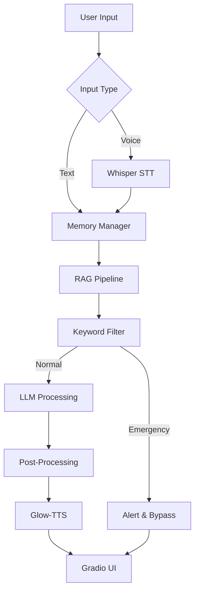

# Sydney_m2 Ultra Fast Version
Sydney – Ultra Fast Version , Local multimodal voice AI for medical guidance. Offline, CPU‑friendly, powered by MedGemma-4B/Gemma3:1B, Whisper Tiny (Customizable); Glow‑TTS. RAG + memory = smart, fast insights. accurate, context-aware responses.

Demo Video : https://www.linkedin.com/posts/avijit-shil-427125332_introducing-sydneym2-the-ultra-fast-activity-7395222937416429568-yuJu?utm_source=social_share_send&utm_medium=member_desktop_web&rcm=ACoAAFOq8h8B-_Tw1qwZu38sKyDkMJPwR5kXX6Y

## **🚀 Key Highlights**

* 🧠 **Multimodal**: Supports both **text** and **voice input/output** in the same version.
* 📚 **Offline-first**: Entirely functional without internet once models and embeddings are downloaded.
* ⚡ **CPU-optimized**: Fast inference even on standard CPUs without compromising response quality.
* 🛠 **Context-aware memory**: Stores user queries and AI responses, allowing nuanced conversations.
* 🔍 **Multiple RAG pipelines**: Integrates **local medical documents** and **Granite 47M R2 embeddings** for factual, precise, and comprehensive answers.
* 💡 **Problem-solving powerhouse**: Capable of **complex multi-topic medical reasoning**, combining retrieval and generative capabilities.
* 🎯 **Clean & structured outputs**: Markdown removal, concise formatting, and speech-ready text.
* 🚨 **Emergency detection**: Flags urgent situations and provides immediate guidance to contact professionals.

---

## **🧩 Multimodal & Offline Architecture**

Sydney is designed as a **unified multimodal AI assistant**:

# Medical AI Assistant - System Architecture

## 📋 Overview
```
┌─────────────────────────────────────────────────────────────────────┐
│                        MEDICAL AI ASSISTANT                         │
│                         System Architecture                         │
└─────────────────────────────────────────────────────────────────────┘
```

## 🔄 System Flow

### 1️⃣ Input Layer
```
┌──────────────┐
│ User Input   │  ← Text or Voice
│ Text / Voice │
└──────┬───────┘
       ↓
┌──────────────────────────────┐
│ Whisper Speech-to-Text       │
│ (Voice input transcription)  │
└──────────────┬───────────────┘
```

### 2️⃣ Memory Management
```
┌──────────────────────────────┐
│ Memory Manager               │
│  • Tracks last N turns       │
│  • Maintains context         │
│  • Preserves conversation    │
└──────────────┬───────────────┘
```

### 3️⃣ Knowledge Retrieval
```
┌──────────────────────────────┐
│ RAG Pipeline                 │
│  • Local medical documents   │
│  • Granite 47M R2 embeddings │
│  • Semantic search & combine │
└──────────────┬───────────────┘
```

### 4️⃣ Safety Layer
```
┌──────────────────────────────┐
│ Critical Keywords Filter     │
│ Checks for: "chest pain",    │
│ "difficulty breathing", etc. │
└────┬─────────────────────┬───┘
     │                     │
 [Emergency]          [Normal Query]
     │                     │
     ↓                     ↓
┌────────────────┐    [Continue to LLM]
│ EMERGENCY MODE │
│ • Output alert │
│ • Bypass LLM   │
│ • Contact help │
└────────────────┘
```

### 5️⃣ AI Processing
```
┌──────────────────────────────┐
│ LLM Processing               │
│  • Concise responses         │
│  • Context-aware reasoning   │
│  • Multi-topic handling      │
└──────────────┬───────────────┘
```

### 6️⃣ Output Formatting
```
┌──────────────────────────────┐
│ Post-Processing & Cleanup    │
│  • Markdown removal          │
│  • Bullet formatting         │
│  • Text normalization        │
└──────────────┬───────────────┘
```

### 7️⃣ Speech Synthesis
```
┌──────────────────────────────┐
│ Glow-TTS Speech Synthesis    │
│  • Natural voice output      │
│  • Expressive intonation     │
└──────────────┬───────────────┘
```

### 8️⃣ User Interface
```
┌──────────────────────────────┐
│ Gradio UI                    │
│  📝 Text Output              │
│  🔊 Voice Output             │
└──────────────────────────────┘
```

---

## ✨ Key Features

| Feature | Description |
|---------|-------------|
| 🎤 **Multimodal Input** | Supports both voice (Whisper STT) and text input |
| 🧠 **Intelligent Memory** | Maintains conversation context across multiple turns |
| 📚 **RAG Pipeline** | Retrieves relevant information from local medical documents |
| 🚨 **Emergency Detection** | Real-time keyword filtering for critical symptoms |
| 💬 **Smart Processing** | Context-aware LLM with multi-topic reasoning |
| 🗣️ **Natural Voice** | Glow-TTS for expressive speech synthesis |
| 🖥️ **User-Friendly UI** | Clean Gradio interface with dual output modes |

---

## 🚨 Safety Features

The system includes a **Critical Keywords Filter** that:
- Monitors for emergency terms (e.g., "chest pain", "difficulty breathing")
- Immediately triggers emergency protocols
- Bypasses normal processing to provide instant alerts
- Recommends contacting emergency services

---

## 🛠️ Technology Stack

- **Speech-to-Text**: Whisper
- **Embeddings**: Granite 47M R2
- **Text-to-Speech**: Glow-TTS
- **Interface**: Gradio
- **Architecture**: RAG (Retrieval-Augmented Generation)

---

## 📊 Data Flow


---

## 📝 Usage Example

1. **User speaks or types**: "I have a mild headache"
2. **System processes**: Whisper converts voice → Memory recalls context → RAG retrieves relevant info
3. **Safety check**: Keywords analyzed (no emergency detected)
4. **LLM generates**: Context-aware medical advice
5. **Output delivered**: Text + voice response via Gradio UI

---

## ⚠️ Disclaimer

This is an AI assistant for informational purposes only. It is not a substitute for professional medical advice, diagnosis, or treatment. Always seek the advice of qualified health providers with questions about medical conditions.

- **Critical Keywords/Emergency Filter**: Skips regular processing and contacts emergency services when critical medical terms (like “chest pain”) are detected.
- **MedGemma-4B as default LLM**, with mention of other MedGemma models as possible options.
- **Configurable Whisper Models**: Can use any Whisper model (“tiny” to “large”) and switch to GPU if available.

***

## 💾 Memory & Context Management

Sydney’s **conversation memory** is persistent, intelligent, and context-aware:

- Stores all queries and AI responses in `memory.json`.
- Memory is limited to a configurable recent number of turns (default: 10) for speed.
- Every new query is automatically enriched with recent context, ensuring:
  - Coherent multi-turn conversations  
  - Avoiding repetition  
  - Tailored responses based on your history

**Example Context-Aware Query:**

```
Recent context:
User: I have diabetes and high blood pressure. Can I exercise daily?
Assistant: Light cardio 3-5 times/week, strength training, and regular monitoring.

Current query: What dietary changes should I implement alongside exercise?
Assistant: - Low glycemic index foods, high fiber intake ...
           - Reduce sodium and processed foods ...
           - Maintain protein balance for muscle health ...
```

***

## 🚨 Critical Keywords Filter & Emergency Handling

Sydney now includes a **Critical Keywords Filter** for urgent health issues:

- Scans user input (text or speech) for life-threatening terms (e.g. “chest pain”, “shortness of breath”, “stroke”).
- If any critical medical keyword is detected:
  - Bypasses normal reasoning, RAG, LLM, and TTS pipelines.
  - Immediately triggers an emergency response, outputs clear instructions, and prompts to contact healthcare authorities or nearest emergency services.
- Customizable emergency keyword list and response logic in `is_medical_emergency()` and `get_emergency_response()`.

***

## 📚 Multiple RAG Pipelines for Robust Knowledge Retrieval

Sydney uses multiple powerful RAG systems to provide factually-grounded answers:

1. **Local Medical Knowledge Base RAG**  
   - A curated offline document set covering diseases, symptoms, nutrition, and lifestyle.

2. **Granite 47M R2 Embeddings RAG**  
   - Embedding-based, high-speed semantic vector search.  
   - Especially effective for rare or multi-faceted medical questions.

**Benefits:**
- Multi-topic reasoning and recommendations
- Context-enhanced answers
- Medical outputs based on reliable, stored sources

***

## 💨 Offline & CPU-Optimized Performance

Sydney is engineered for **offline, CPU-optimized operation**:

- **Glow-TTS + Multi-band MelGAN** for natural audio without a GPU.
- **Whisper ASR**: Select any model size (`tiny` to `large`), INT8 or full precision, with auto GPU fallback for faster transcription if CUDA is detected.
- **Precomputed Granite embeddings** for instant retrieval.
- **Chunking long responses** prevents CPU overload.
- **Async threading and persistent memory caching** for non-blocking, fast UI.

> **Result:** High-speed inference and voice output — even on standard CPUs, with zero reliance on cloud services.

***

## 💡 Problem-Solving Capabilities

Sydney is a true problem-solving assistant:

- Multi-step reasoning: Synthesizes symptoms, conditions, and treatment options.
- Cross-topic retrieval: RAG + memory + LLM combine for actionable guidance.
- Structured answers: Always organized as clear bullet points and warnings.

***

## 🌟 Why Sydney Stands Out

- **Multimodal**: Seamless support for both text and voice input/output.
- **Offline & CPU-Optimized**: Works fully offline, lightweight even on basic hardware.
- **Memory + Multi-RAG**: Maintains context, retrieves the most accurate information, solves multi-topic questions.
- **Granite 47M R2 Embeddings**: Advanced semantic retrieval for medical reasoning.
- **Critical Keyword Filter**: Ensures safety by immediately routing emergencies.
- **Model Flexibility**: Choose any Whisper version for STT; switch to GPU if available.
- **MedGemma-4B as LLM**: Uses Google’s open-source “MedGemma-4B” (or switchable among available MedGemma variants), optimized for medical and health prompts.
- **Problem-solving ready**: Stepwise reasoning and actionable suggestions.

***

**Example Use Case:**

```
User: I have hypertension and mild kidney issues. Can I exercise, and what should I eat?
Assistant: 
- Exercise: Low-impact cardio, yoga, 3-5 times/week
- Diet: Low sodium, moderate protein, avoid processed foods
- Monitor: Blood pressure and kidney function regularly
- Warning: Avoid strenuous exercises that elevate blood pressure rapidly
```

***

## ⚙ Installation

#### 1. Clone the Repository

```bash
git clone https://github.com/AvijitShil/Sydney_m2.git
cd Sydney_m2
```

#### 2. Setup Python Environment

```bash
python -m venv venv
source venv/bin/activate   # Linux/Mac
venv\Scripts\activate      # Windows
```

#### 3. Install Dependencies

```bash
pip install -r requirements.txt
```
Or manually:
```bash
pip install torch numpy gradio soundfile coqui-tts faster-whisper langchain_ollama
```

***

## 🚀 Usage

#### Launch Sydney

```bash
python main.py
```

#### Gradio Interface

- **Chat Tab:** Type health questions → get both text **and** audio.
- **Speak Tab:** Record spoken queries → instant transcription (using Whisper), text + audio output.
- **Emergency Tab:** If triggered by critical keywords, instantly routes you to emergency instructions.
- **Whisper Model Selection:** Change ASR model via config (`tiny`, `base`, `small`, `medium`, `large`) and select CPU/GPU mode.
- **LLM Model:** Default is **MedGemma-4B**, but you may switch to other MedGemma versions as needed.

***

## 🔧 Customization

- **Memory Size:** Adjust `CONFIG["max_memory_turns"]`.
- **TTS Speed / Style:** Change `speed` parameter in `tts_to_file()`.
- **Knowledge Base Expansion:** Add medical documents to `CONFIG["medical_docs"]`.
- **Emergency keywords & handling:** Customize in `is_medical_emergency()` and `get_emergency_response()`.
- **Model selection:** Switch Whisper model or toggle GPU/CPU via configuration.

***

## 📂 Folder Structure

```
.
├─ main.py                # Core application
├─ rag_system.py          # RAG & emergency handling
├─ requirements.txt       # Dependencies
├─ memory.json            # Persistent conversation memory
├─ config.py              # Configuration logic and model switching
└─ README.md
```

***

## 💡 Contributing

- Fork & PR for improvements
  - Fine-tune TTS or LLM for naturalness
  - Add medical resources or RAG connectors
  - Enhance offline performance or add additional models
- Ensure **no actual medical advice is hard-coded**

***

## 📜 License

MIT License — see LICENSE for details.

***

## ⚕️ IMPORTANT MEDICAL DISCLAIMER

This AI assistant is for **educational and informational purposes only**.
It cannot and should not replace professional medical advice, diagnosis, or treatment.
**Always consult qualified healthcare professionals for any health concerns.**

***

## 🚀 Features

- **🎤 Speech-to-Text (STT):** Fully local with configurable Whisper models (tiny–large) & automatic GPU detection
- **🧠 LLM Processing:** MedGemma-4B (default) via Ollama; supports all Gemma/MedGemma models
- **🔊 Text-to-Speech (TTS):** GlowTTS for expressive, local synthesis
- **📚 Retrieval-Augmented Generation (RAG):** Knowledge base + vector embeddings
- **💭 Memory Management:** Persistent, multi-turn context
- **🚨 Emergency Detection:** Critical keywords filter for urgent cases
- **⚡ CPU/GPU Optimized:** Async, model caching, chunking, and low-resource safe

***

## 📋 Requirements

- **Python:** 3.8 or higher
- **RAM:** 8GB (minimum), 16GB recommended
- **Storage:** ~5GB free for models
- **Dependencies:**
  - PyTorch (CPU/CUDA)
  - Ollama (for LLM hosting)
  - Audio drivers (mic & speaker)
- **Optional:** CUDA-enabled GPU for Whisper

***

## 📁 Project Structure

```
sydney/
├── main.py
├── rag_system.py
├── config.py
├── requirements.txt
├── memory.json
├── response.json
└── medical_knowledge_db/
```

***

## 🔒 Privacy & Safety

- **100% Local Processing:** No cloud dependency, private by design
- **Configurable Memory:** All data stored locally; optional encryption
- **Critical Keyword Filter:** Protects users, instant emergency handling
- **Medical Disclaimers:** Always appended where appropriate

***

## 🚀 Performance Optimizations

- **Async Processing:** Non-blocking STT, LLM, and TTS
- **Model Caching:** Rapid warm-up and switching
- **Memory Management:** Rolling context, persistent storage
- **Embeddings Search:** Fast RAG retrieval

***

## 🛡️ Safety Features

1. **Critical Keywords Filter:** Auto-flags emergencies, instantly outputs instructions
2. **Medical Disclaimers:** Always included for health queries
3. **Graceful Fallbacks:** Safe on low-resources or mismatched hardware
4. **Local-Only:** Nothing leaves your device

***

Sydney is **not just an assistant—it’s an offline, multimodal AI medical companion** powering advanced reasoning, robust safety, and privacy-focused local operation, built on state-of-the-art models and retrieval pipelines.
